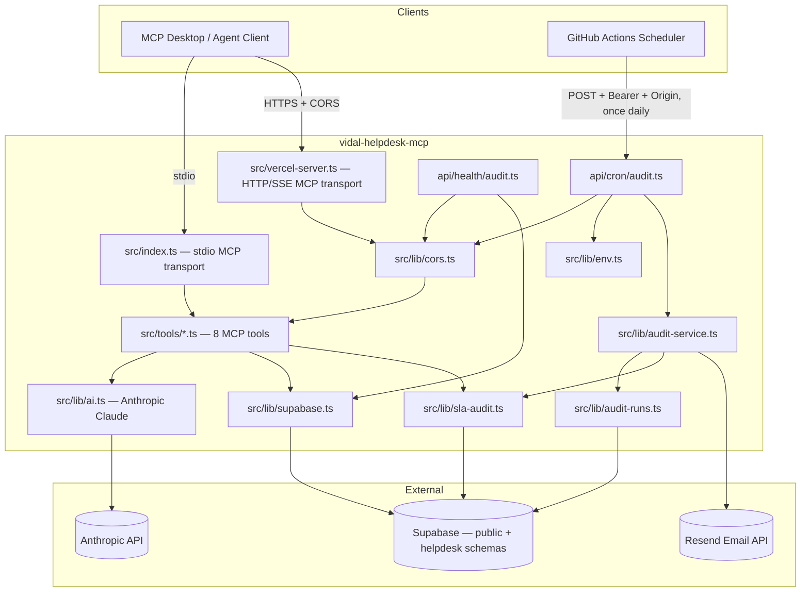

# ARCHITECTURE.md

## Overview

`vidal-helpdesk-mcp` is a TypeScript/Node service with two runtime surfaces sharing one source tree: an MCP tool server and a scheduled SLA-audit function. It has no UI and no auth of its own — it is a backend automation layer over a Supabase schema (project "Ticket System", `focgfmhgfmhmcbywwsej`) owned by another application. This repo does not carry a migration framework, but as of 2026-07-22 it does track the SQL for the one schema change it has needed in `supabase/migrations/` (see below) — that's a record of intent, not a runnable migration pipeline.



## Components

| Layer | Path | Responsibility |
|---|---|---|
| MCP stdio entrypoint | `src/index.ts` | Registers all 8 tools, validates required env vars at boot, connects a `StdioServerTransport`. Used by local/desktop MCP clients. |
| MCP HTTP/SSE entrypoint | `src/vercel-server.ts` | Same 8 tools, served over `/sse` + `/messages` on Vercel. Re-implements CORS + routing by hand (raw `http` module, no framework). Session state is an in-memory `Map<sessionId, SSEServerTransport>` — **not durable across serverless invocations**, see Known Limitations. |
| Tool handlers | `src/tools/*.ts` | One file per tool. Each exports a Zod schema and an async handler that talks to Supabase (and, for triage tools, Anthropic). `get-sla-audit-report.ts` is read-only and delegates to `sla-audit.ts`. |
| Tool wiring | `src/lib/mcp-tool-handler.ts` | Wraps a handler with Zod parsing; malformed input returns a structured `{success:false, issues:[...]}` payload instead of throwing. |
| AI triage | `src/lib/ai.ts` | Two Anthropic calls: `triageTicket` (category/priority/sentiment/summary/smart-response) and `generateSolution` (multilingual step-by-step fix). Model is hardcoded to `claude-sonnet-4-20250514`. |
| Supabase access | `src/lib/supabase.ts` | Builds a single cached service-role client. `SUPABASE_SCHEMA` selects which schema ticket-domain tools read/write (defaults to `public`, matching production). `getHelpdeskSchema()` always targets the literal `helpdesk` schema regardless of `SUPABASE_SCHEMA` — that's where `audit_runs` actually lives (see below). Exposes `resolveCategoryId` for slug lookups. |
| Runtime env validation | `src/lib/env.ts` | Zod schema over `process.env`, parsed fresh on every call (not cached at import time) so env changes are picked up without a restart in dev. |
| CORS | `src/lib/cors.ts` | Deny-by-default allowlist keyed on normalized `Origin` header. Used by both `vercel-server.ts` and the `api/*` functions. |
| SLA aggregation | `src/lib/sla-audit.ts` | Read-only. Queries active tickets for the org, resolves each requester's company via a batched `customers_info` lookup (two queries total, not N+1), classifies each ticket's SLA status, and builds the company/VIP-risk/action-item breakdown. Used by both `audit-service.ts` (email) and the `get_sla_audit_report` tool — one aggregation, two consumers. |
| Delivery idempotency | `src/lib/audit-runs.ts` | `claimAuditRunSlot` / `markAuditRunSent` / `markAuditRunFailed` against `helpdesk.audit_runs`. See "Idempotency design" below. |
| Audit service | `src/lib/audit-service.ts` | Orchestrates one audit run: skip if disabled, claim the slot, build the SLA report, render + send the email, record the outcome. |
| Audit endpoints | `api/cron/audit.ts`, `api/health/audit.ts` | Vercel functions. Both require an allowlisted `Origin` and mandatory `AUDIT_CRON_SECRET`. `health` never sends email. |
| Logging | `src/lib/logger.ts` | One JSON line per event to stdout, fields fixed by `LogFields` (requestId, organizationId, workflow, httpStatus, error codes). |

## Data ownership boundary

This repo reads/writes these tables but does not define or migrate them: `tickets`, `categories`, `ai_analysis`, `ticket_comments`, `organizations`, `profiles`, `customers_info`. Their shape is inferred from `src/types/index.ts` and the query call-sites — treat that as documentation of a contract, not a source of truth you can freely extend. If a query needs a column that doesn't appear to exist, that's a cross-repo change, not something to patch around here.

`helpdesk.audit_runs` is the one exception: this app is its sole owner (created for this app's own delivery tracking, referenced only by this codebase). `supabase/migrations/20260722000000_audit_runs_period_idempotency.sql` documents the schema change applied on 2026-07-22 — see "Idempotency design" below for why.

### Company resolution — a two-hop, application-level relationship

`tickets` has no `company_id`/`customer_id` column, and `tickets.created_by` has **no formal foreign key** to `profiles` (verified against the live schema — plenty of this database's relationships are enforced only in application code, not by Postgres). The company associated with a ticket is derived, not stored directly:

```text
tickets.created_by  -- a profile id, unconstrained
  → profiles.id
    → customers_info.id  (1:1 extension table; customers_info.id is a profiles.id, FK-enforced)
      → customers_info.company_name / industry / tax_id
```

`src/lib/sla-audit.ts` resolves this with exactly two queries regardless of ticket count: one for the active tickets, one batched `customers_info.id IN (...)` lookup over the distinct set of requester ids found in the first query. A ticket whose requester has no `customers_info` row (most of them, today — only 2 of ~25 profiles have one) resolves to `company_id: null, company_name: null`, and is grouped under an explicit "Unassigned" bucket rather than dropped.

### Project — confirmed absence, not an omission

There is no ticket-to-project relationship anywhere in this schema. A `projects` table exists in the same database, but it belongs to a different bounded context entirely (a software-deployment registry — `vercel_project_id`, `github_repo`, `lighthouse_score`, `security_status` — referenced only by `deployment_events` and `security_advisories`). `get_sla_audit_report` and the audit email report `project_id`/`project_name` as `null` for every ticket, deliberately, rather than joining against that unrelated table. If a genuine ticket-to-project domain concept is ever needed, it requires a real schema change in the owning app, not a workaround here — see `ROADMAP.md`.

## Idempotency design

`helpdesk.audit_runs` carries a unique constraint on `(organization_id, report_type, reporting_period_start, recipient)`, where `reporting_period_start` is the UTC-midnight start of the calendar day (`getUtcDayPeriod()` in `src/lib/audit-runs.ts`). Every audit invocation for the same org/day/recipient collapses onto the same row.

Claiming a slot (`claimAuditRunSlot`):

1. Try `INSERT ... status='pending'`. If nothing else has a row for this slot, this wins outright.
2. On a unique-violation, fetch the existing row. If `status='sent'`, this is a genuine duplicate — skip, no email, no ticket query. If `status='pending'` and recently updated, another invocation is actively in flight — skip. If `status='failed'`, or `status='pending'` but stale (>10 minutes untouched, e.g. a crashed invocation), attempt a conditional `UPDATE ... WHERE status = <observed status>`.
3. That conditional UPDATE is the actual atomicity boundary: under concurrent callers, Postgres row-level locking means only one UPDATE can match before the other caller's own attempt sees the now-changed status and matches zero rows.

The email is only sent after a successful claim, and the slot is only marked `sent` — with Resend's message id attached — after Resend's API call returns without an error. A send failure marks the slot `failed`, which the *next* invocation (whenever it happens — the daily cron, or a manual `workflow_dispatch`) is allowed to reclaim and retry. A slot already `sent` can never be reclaimed, so a retry cannot duplicate a successful delivery.

There is no HTTP-level force-resend endpoint. Operators must never change
`sent`, `sending`, or `delivery_unknown` to `failed` merely to trigger another
email. Reconcile the audit-run id, idempotency key, provider message id, and
provider logs first; any exceptional resend requires an approved new logical
delivery, not mutation of ambiguous history.

## Deployment topology

Vercel routes (`vercel.json`) three separate functions from one repo:

- `/api/cron/audit` → `api/cron/audit.ts`
- `/api/health/audit` → `api/health/audit.ts`
- everything else → `src/vercel-server.ts` (the MCP HTTP/SSE catch-all)

GitHub Actions (`.github/workflows/audit.yml`) hits `/api/cron/audit` once daily at 06:00 UTC with a bearer secret; `.github/workflows/ci.yml` runs lint/test/build on every PR and push to `main`/`master`.

## Known limitations (by design or by gap — not yet fixed)

- **SSE session map is per-process memory.** On Vercel's serverless model, a new invocation can land on a different instance than the one holding the `sessions` Map, breaking multi-message SSE sessions under scale-out. Fine for low-concurrency use; would need an external session store to scale.
- **Single fixed org per deployment**, not a multi-tenant request-scoped model — see `AGENTS.md` and `DOMAIN.md`.
- **No rate limiting** on the HTTP surfaces beyond the CORS allowlist and optional bearer secret.

## Phase 1 security and delivery model

Remote MCP uses mandatory `MCP_BEARER_TOKEN`; audit uses independent
`AUDIT_CRON_SECRET`. Delivery follows
`pending -> sending -> sent|failed|delivery_unknown`; only `failed` reclaims.
Stable payload hashes/snapshots and `sla-audit/<audit_run_id>` protect retries.
