# vidal-helpdesk-mcp

[](https://composio.dev)
[](https://vercel.com)
[](https://github.com/features/actions)
[](https://supabase.com)
[](https://resend.com)
[](https://www.typescriptlang.org)
[](https://modelcontextprotocol.io)
[](https://www.fedlex.admin.ch)

AI-powered helpdesk control plane for the VIDAL ecosystem. Exposes `ticket-system` through 7 MCP tools via HTTP/SSE, runs an autonomous SLA audit engine on Vercel, and drives hourly compliance reporting through GitHub Actions CI/CD.

## Business Value

`vidal-helpdesk-mcp` acts as an **AI-Powered SLA Auditor** for the Swiss market. It gives Swiss SMEs and MSPs an operational audit layer that watches SLA drift, flags VIP risk, and generates compliance-ready evidence without requiring a human analyst for every reporting cycle.

---

## Live Demo

Two end-to-end demos recorded against real production data — no mocks, no staging.

### Demo 1 · TK-0065 "Error crítico en login (SLA Risk)"

**Input Layer** — Client submits via mobile form (ES), category Software, priority Alta.

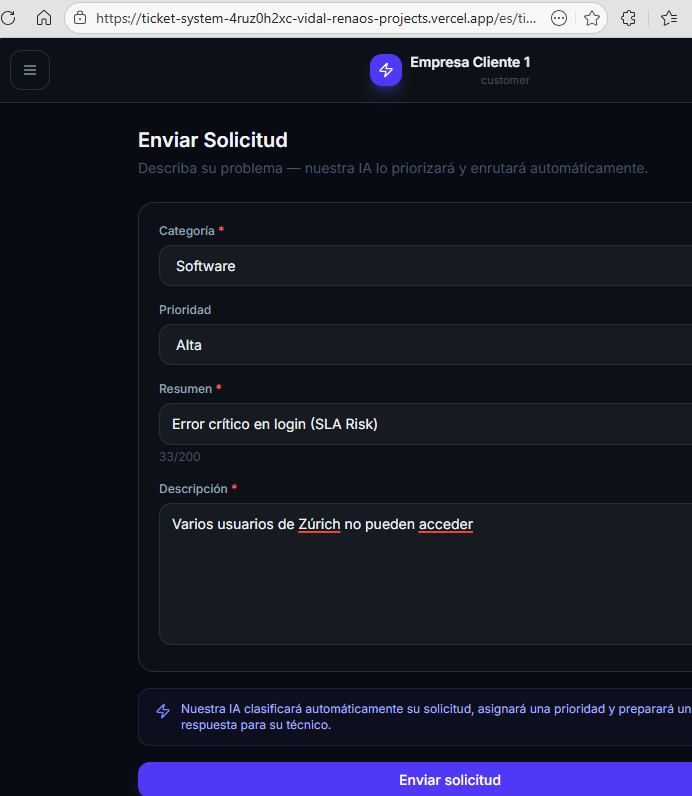

**AI Classification** — Agent view shows AI Triage at 72% confidence, Active Directory category, SLA on time.

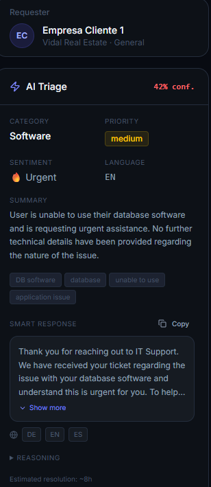

**Autonomous Audit** — GitHub Actions Remote Audit #8 completes in 8s with zero failures.

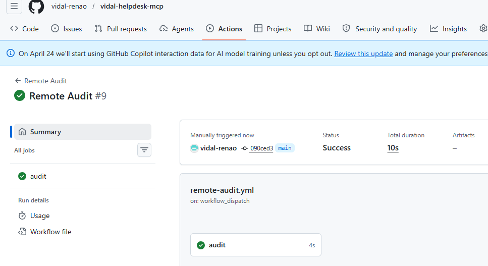

**Notification Layer** — Branded SLA report delivered via Resend: 100% compliance, 4 tickets, Swiss DSG footer.

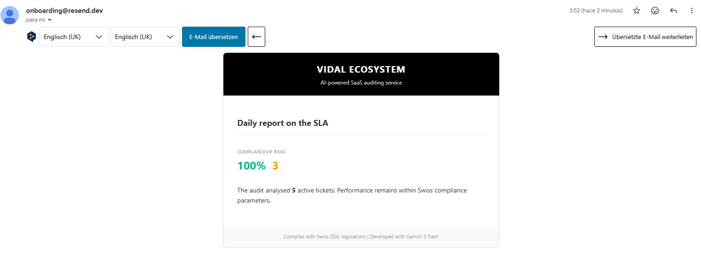

---

### Demo 2 · TK-0066 "I can not use my DB Software"

**Input Layer** — Client submits via desktop form (EN), category Software, priority Critical (SLA).

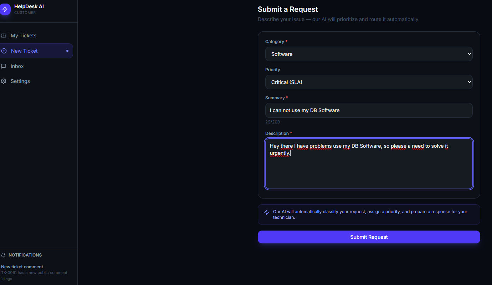

**AI Classification** — 42% confidence · Urgent sentiment · Smart response generated · ~8h resolution estimate.


**Team Communication** — Agent internal note + client reply + admin escalation, all with DE/EN/ES translation.

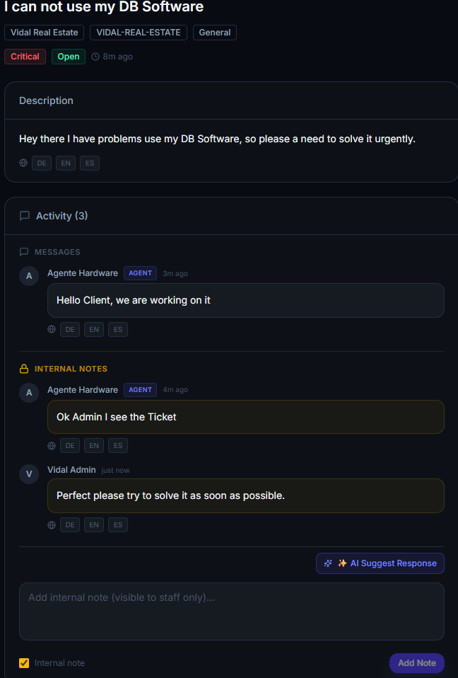

**Executive Overview** — Real-time dashboard: 5 open tickets, 1 critical, 0 SLA breached, By Category chart.

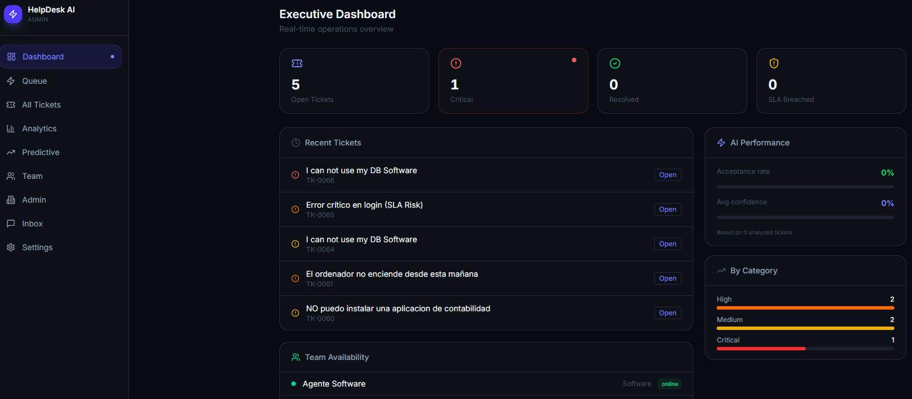

**Urgent Queue** — Admin queue detects URGENT / SLA BREACHED — one-click Assign for immediate response.

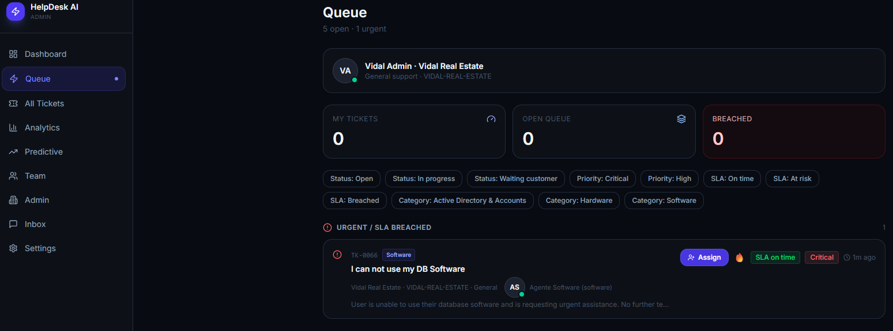

**CI/CD Pipeline** — GitHub Actions Remote Audit #9 completes in 10s, fully autonomous.


**Notification Layer** — 100% SLA compliance across 5 tickets, 3 VIP risks flagged. Swiss DSG certified footer.


---

## Three Pillars

### 1 · Backend — Supabase PostgreSQL

The data layer. All ticket reads, SLA compliance queries, and write-backs hit Supabase directly through a service-role client (`src/lib/supabase.ts`) pinned to the isolated `helpdesk` schema by default. Active statuses tracked: `open`, `in_progress`, `pending_customer`, `pending_third_party`.

### 2 · MCP Bridge — Vercel SSE Server

The tool layer. `src/vercel-server.ts` exposes 7 MCP tools over HTTP/SSE. Any MCP-compatible client (Claude Desktop, remote agent) can connect and operate on tickets programmatically.

| Tool | What it does |
|---|---|
| `create_ticket` | Create ticket with AI triage. Returns `TK-XXXX` ref. |
| `get_ticket_status` | Fetch ticket by ref or UUID. Includes SLA state and AI analysis. |
| `list_tickets` | List tickets with optional status/priority filters. |
| `prioritize_incident` | Re-run AI triage with new context. Updates if confidence ≥ 60%. |
| `suggest_solution` | Generate step-by-step solution in DE/EN/ES/FR/IT. Saves as internal comment. |
| `update_ticket_status` | Update ticket status with optional comment. |
| `generate_report` | SLA compliance report for today/week/month. |

### 3 · Autonomous Audit — GitHub Actions → Vercel → Resend

The automation layer. A GitHub Actions workflow fires every hour, triggers the Vercel audit function, which queries Supabase, computes SLA compliance, and sends a branded HTML report via Resend — no human intervention required.

---

## Full System Flow

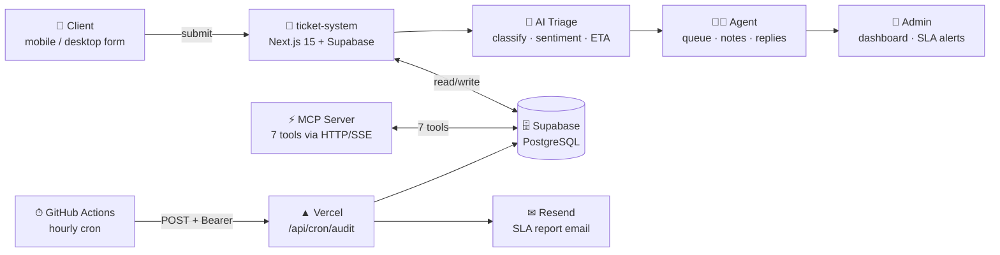

---

## CI/CD Flow

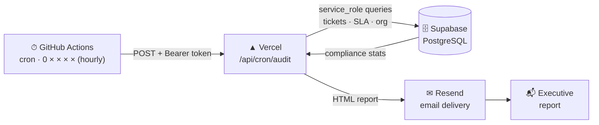

**Step-by-step:**
1. GitHub Actions runs `remote-audit.yml` on cron (`0 * * * *`) or `workflow_dispatch`
2. Sends `POST /api/cron/audit` with `Authorization: Bearer $VIDAL_MCP_AUDIT_SECRET`
3. Vercel executes `api/cron/audit.ts` — validates auth via `AUDIT_CRON_SECRET`
4. Queries Supabase for active tickets, SLA compliance %, and VIP/high-risk count
5. Renders branded HTML via `src/lib/audit-template.ts`
6. Sends report through Resend (`RESEND_API_KEY`)
7. GitHub marks run failed on any non-2xx response

---

## MCP Architecture

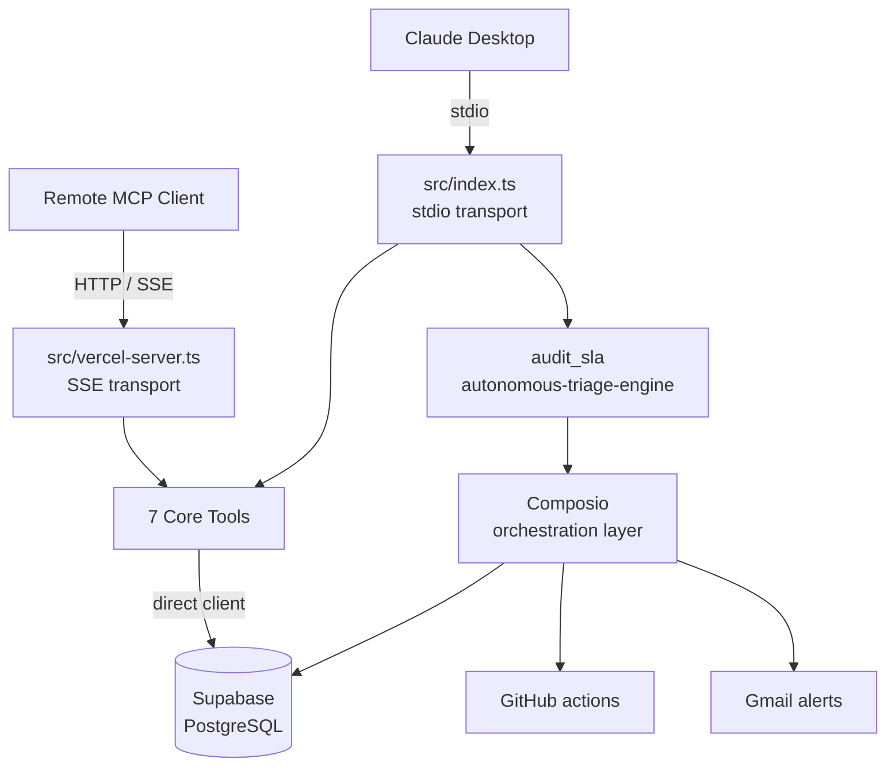

The codebase supports two execution modes:

| Mode | Path | Use case |
|---|---|---|
| **Direct audit** | Vercel → Supabase → Resend | Scheduled, predictable SLA reporting |
| **Orchestrated** | MCP tools → Composio → Supabase / GitHub / Gmail | Advanced workflows: RCA, escalation, issue automation |

---

## Architecture Table

| Layer | Path | Purpose |
|---|---|---|
| Core | `src/index.ts` | StdIO MCP entrypoint for local and desktop clients |
| Core | `src/vercel-server.ts` | HTTP/SSE MCP server for Vercel deployment |
| Core | `src/lib/` | Shared clients, orchestration adapters, audit logging, and schema capability helpers |
| Tools | `src/tools/` | Business tools for SLA audit, triage, reporting, prioritization, and ticket updates |
| Database | `src/lib/supabase.ts` | Centralized Supabase service-role client pinned to the isolated schema |
| Database | `docs/sql/` | SQL assets and database hardening references |
| Delivery | `api/cron/audit.ts` | Scheduled audit endpoint that computes and sends SLA reports |
| Delivery | `.github/workflows/` | Recurring automation for compliance and audit execution |

---

## Vercel Routing

Defined in `vercel.json`:

```
/api/cron/audit  →  api/cron/audit.ts   (audit endpoint)
/*               →  src/vercel-server.ts  (MCP SSE server)
```

The audit path is explicit to prevent the MCP catch-all from shadowing it.

---

## Environment Variables

Required for the remote audit path:

```bash
SUPABASE_URL=
SUPABASE_SERVICE_ROLE_KEY=
SUPABASE_SCHEMA=helpdesk
MCP_ORGANIZATION_ID=
AUDIT_CRON_SECRET=
RESEND_API_KEY=
RESEND_FROM_EMAIL=
```

Required for the Composio orchestration layer:

```bash
COMPOSIO_API_KEY=
COMPOSIO_USER_ID=
MCP_AGENT_ID=
```

GitHub Actions secrets required:

```
VIDAL_MCP_AUDIT_URL      # deployed /api/cron/audit URL
VIDAL_MCP_AUDIT_SECRET   # matches AUDIT_CRON_SECRET
```

---

## Local Commands

```bash
npm install
npm run build      # tsc
npm run dev        # tsx watch src/index.ts (stdio MCP)
npm run start      # node dist/index.js
npm run lint       # tsc --noEmit
```

---

## Swiss-Market Notes

- Multi-tenant scope is driven by `MCP_ORGANIZATION_ID` — all queries are org-scoped.
- The audit email reports aggregated SLA indicators only; no ticket body content is included.
- Aligned with the Swiss revDSG / DSG compliance positioning of the wider `ticket-system` platform.
- Reports carry "Complies with Swiss DSG regulations" footer, generated via Gemini 3 Flash.

---

## Related

- [`ticket-system`](https://github.com/vidal-renao/ticket-system) — the SaaS helpdesk platform this MCP layer operates on
- Live MCP endpoint: [vidal-helpdesk-mcp.vercel.app](https://vidal-helpdesk-mcp.vercel.app)
