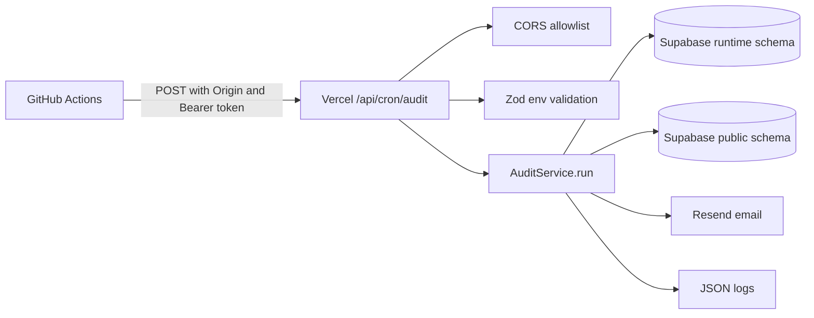

# VIDAL Helpdesk MCP

[](https://www.typescriptlang.org)
[](https://nextjs.org)
[](https://supabase.com)
[](https://vercel.com)
[](https://vitest.dev)
[](https://zod.dev)
[](https://modelcontextprotocol.io)

AI-powered helpdesk infrastructure for the VIDAL ecosystem. This repository provides a production-oriented MCP server and scheduled audit runtime for Swiss SME support operations, with explicit schema isolation, strict CI, runtime validation, structured logging, and defensive CORS controls.

## Business Context

`vidal-helpdesk-mcp` acts as an AI-enabled control plane for helpdesk automation. It exposes operational ticket workflows through Model Context Protocol tools, connects to Supabase for the helpdesk data plane, and runs scheduled SLA audits through Vercel and GitHub Actions.

The system is designed for Swiss SME expectations around reliability, privacy, and operational evidence:

- Organization-scoped reads and writes.
- Explicit runtime schema boundaries through `SUPABASE_SCHEMA`.
- Service-role access isolated to backend runtimes.
- Runtime environment validation with Zod.
- Structured JSON logs suitable for Vercel Log Drains, Datadog, or SIEM ingestion.
- CORS deny-by-default using `ALLOWED_ORIGINS`.

## Architecture Principles

| Principle | Implementation |
|---|---|
| Deterministic delivery | `npm ci`, strict Vitest, TypeScript build, and CI gates |
| Zero-trust perimeter | No wildcard CORS; every runtime origin must be allowlisted |
| Runtime validation | Centralized Zod schema in `src/lib/env.ts` |
| Data separation | Helpdesk domain data in `SUPABASE_SCHEMA`; shared organization lookup in `public` |
| Observability | One-line JSON logs with request, workflow, HTTP, Supabase, and Resend metadata |
| Privacy by design | Aggregated SLA reporting and backend-only service-role access |
| Performance discipline | API-first serverless runtime; companion frontends should be measured with Lighthouse targets of 100 for Performance, Accessibility, Best Practices, and SEO |
| Compliance discipline | DSG/GDPR posture depends on deployment controls, encryption, access policy, retention policy, and processor agreements; this repository provides implementation primitives, not legal certification |

## Directory Architecture

| Layer | Path | Responsibility |
|---|---|---|
| Vercel API | `api/cron/audit.ts` | HTTP transport for scheduled audit execution |
| MCP stdio | `src/index.ts` | Local MCP entrypoint for desktop or agent clients |
| MCP HTTP/SSE | `src/vercel-server.ts` | Remote MCP transport deployed on Vercel |
| Business services | `src/lib/audit-service.ts` | SLA metric aggregation, audit persistence, and email delivery |
| Runtime validation | `src/lib/env.ts` | Zod validation for environment variables |
| Security boundary | `src/lib/cors.ts` | Dynamic allowlist CORS enforcement |
| Observability | `src/lib/logger.ts` | Structured JSON logging for Vercel and log drains |
| Database access | `src/lib/supabase.ts` | Supabase client and explicit schema helpers |
| MCP tooling | `src/tools/` | Ticket creation, status, prioritization, solution generation, reporting |
| Tests | `tests/` | Vitest backend coverage with Supabase and Resend mocks |
| CI/CD | `.github/workflows/` | Strict CI and scheduled audit workflow |

## Runtime Flow


```mermaid
flowchart LR
  GHA[GitHub Actions] -->|POST with Origin and Bearer token| API[Vercel /api/cron/audit]
  API --> CORS[CORS allowlist]
  API --> ENV[Zod env validation]
  API --> SVC[AuditService.run]
  SVC --> HD[(Supabase runtime schema)]
  SVC --> PUB[(Supabase public schema)]
  SVC --> RESEND[Resend email]
  SVC --> LOGS[JSON logs]
```

## Operational Configuration

Create `.env` locally or configure the same variables in Vercel.

```bash
SUPABASE_URL=https://your-project-id.supabase.co
SUPABASE_SERVICE_ROLE_KEY=your-service-role-key
SUPABASE_SCHEMA=public
VIDAL_MCP_AUDIT_URL=https://your-vercel-domain.example/api/cron/audit

MCP_ORGANIZATION_ID=your-organization-uuid
MCP_AGENT_ID=your-agent-uuid

ANTHROPIC_API_KEY=sk-ant-your-key

AUDIT_CRON_SECRET=your-audit-cron-secret
AUDIT_EMAIL_ENABLED=true
AUDIT_EMAIL_DEDUPE_MINUTES=120
RESEND_API_KEY=re_your_key
RESEND_FROM_EMAIL=helpdesk@example.com

ALLOWED_ORIGINS=https://your-helpdesk-domain.example,https://your-mcp-domain.example
```

### ALLOWED_ORIGINS Format

`ALLOWED_ORIGINS` is a comma-separated allowlist. Each entry must be a full origin including protocol and host.

Valid:

```bash
ALLOWED_ORIGINS=https://app.example.ch,https://vidal-helpdesk-mcp.vercel.app
```

Invalid:

```bash
ALLOWED_ORIGINS=app.example.ch,*
```

If `ALLOWED_ORIGINS` is absent during `npm run build`, the build still succeeds. If it is empty at runtime for protected endpoints, the service returns a controlled runtime error instead of silently allowing access.

## GitHub Actions Secrets

```bash
VIDAL_MCP_AUDIT_URL=https://your-vercel-domain.example/api/cron/audit
VIDAL_MCP_AUDIT_SECRET=your-audit-cron-secret
```

The scheduled audit workflow derives the `Origin` header from `VIDAL_MCP_AUDIT_URL`. That origin must also be present in `ALLOWED_ORIGINS`.

## Local Development

```bash
npm ci
npm run lint
npm test
npm run build
npm run dev
```

## CI Gates

The CI workflow is strict:

```bash
npm ci
npm run lint
npm test
npm run build
```

There is no test bypass. Any failing test aborts the pipeline.

## Audit Endpoint

Endpoint:

```text
POST /api/cron/audit
```

Required headers:

```http
Origin: https://your-allowlisted-origin.example
Authorization: Bearer <AUDIT_CRON_SECRET>
Content-Type: application/json
```

Runtime responsibilities:

- Validate `Origin` against `ALLOWED_ORIGINS`.
- Validate runtime environment variables.
- Query active tickets from `SUPABASE_SCHEMA`.
- Query shared organization metadata from the `public` schema.
- Calculate SLA compliance.
- Send audit email via Resend.
- Persist audit run evidence.
- Emit structured logs.

## Audit Health Endpoint

Endpoint:

```text
GET /api/health/audit
```

Required headers:

```http
Origin: https://your-allowlisted-origin.example
Authorization: Bearer <AUDIT_CRON_SECRET>
```

This endpoint checks runtime configuration and Supabase connectivity without sending emails.

```json
{
  "status": "ok",
  "supabase": "ok",
  "resend": "configured",
  "schema": "public",
  "organizationId": "set",
  "emailEnabled": true,
  "dedupeMinutes": 120
}
```

## Structured Logging

Every audit event is written as a single JSON line to `stdout`.

```json
{
  "timestamp": "2026-06-11T17:42:10.916Z",
  "level": "info",
  "requestId": "request-id",
  "organizationId": "organization-id",
  "workflow": "audit-cron",
  "httpStatus": 200,
  "supabaseErrorCode": null,
  "resendErrorCode": null,
  "message": "Audit cron completed"
}
```

This format is compatible with Vercel logs, Vercel Log Drains, Datadog pipelines, and SIEM ingestion.

## MCP Tools

| Tool | Purpose |
|---|---|
| `create_ticket` | Create a ticket with AI triage |
| `get_ticket_status` | Fetch ticket state and SLA metadata |
| `list_tickets` | List tickets with status and priority filters |
| `prioritize_incident` | Re-run AI triage and update priority when confidence allows |
| `suggest_solution` | Generate multilingual support guidance |
| `update_ticket_status` | Update lifecycle status and optional internal notes |
| `generate_report` | Generate helpdesk reporting for today, week, or month |

All MCP tool inputs are validated with Zod before execution.

## Production Notes

- Configure `ALLOWED_ORIGINS` before enabling scheduled audits.
- Keep `SUPABASE_SERVICE_ROLE_KEY` backend-only.
- Rotate `AUDIT_CRON_SECRET` and GitHub Actions secrets periodically.
- Use Vercel production environment variables, not preview defaults, for scheduled workflows.
- Connect Vercel Log Drains or Datadog before relying on the audit workflow as operational evidence.
