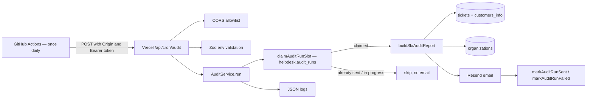

# VIDAL Helpdesk MCP

[](https://www.typescriptlang.org)
[](https://nextjs.org)
[](https://supabase.com)
[](https://vercel.com)
[](https://vitest.dev)
[](https://zod.dev)
[](https://modelcontextprotocol.io)

AI-powered helpdesk infrastructure for the VIDAL ecosystem. This repository provides a production-oriented MCP server and scheduled audit runtime for Swiss SME support operations, with explicit schema isolation, strict CI, runtime validation, structured logging, and defensive CORS controls.

## Business Context

`vidal-helpdesk-mcp` acts as an AI-enabled control plane for helpdesk automation. It exposes operational ticket workflows through Model Context Protocol tools, connects to Supabase for the helpdesk data plane, and runs scheduled SLA audits through Vercel and GitHub Actions.

The system is designed for Swiss SME expectations around reliability, privacy, and operational evidence:

- Organization-scoped reads and writes.
- Explicit runtime schema boundaries through `SUPABASE_SCHEMA`.
- Service-role access isolated to backend runtimes.
- Runtime environment validation with Zod.
- Structured JSON logs suitable for Vercel Log Drains, Datadog, or SIEM ingestion.
- CORS deny-by-default using `ALLOWED_ORIGINS`.

## Architecture Principles

| Principle | Implementation |
|---|---|
| Deterministic delivery | `npm ci`, strict Vitest, TypeScript build, and CI gates |
| Zero-trust perimeter | No wildcard CORS; every runtime origin must be allowlisted |
| Runtime validation | Centralized Zod schema in `src/lib/env.ts` |
| Data separation | Helpdesk domain data in `SUPABASE_SCHEMA`; shared organization lookup in `public` |
| Observability | One-line JSON logs with request, workflow, HTTP, Supabase, and Resend metadata |
| Privacy by design | Aggregated SLA reporting and backend-only service-role access |
| Performance discipline | API-first serverless runtime; companion frontends should be measured with Lighthouse targets of 100 for Performance, Accessibility, Best Practices, and SEO |
| Compliance discipline | DSG/GDPR posture depends on deployment controls, encryption, access policy, retention policy, and processor agreements; this repository provides implementation primitives, not legal certification |

## Directory Architecture

| Layer | Path | Responsibility |
|---|---|---|
| Vercel API | `api/cron/audit.ts` | HTTP transport for scheduled audit execution |
| MCP stdio | `src/index.ts` | Local MCP entrypoint for desktop or agent clients |
| MCP Streamable HTTP | `src/vercel-server.ts` | Stateless authenticated `POST /mcp` transport |
| Business services | `src/lib/audit-service.ts` | Orchestrates the daily audit: claims an idempotency slot, builds the SLA report, sends the email, records the outcome |
| SLA aggregation | `src/lib/sla-audit.ts` | Shared, read-only computation of compliance %, per-company ticket breakdown, and VIP risks — used by both the audit email and the `get_sla_audit_report` MCP tool |
| Delivery idempotency | `src/lib/audit-runs.ts` | Atomic claim/sent/failed state machine against `helpdesk.audit_runs`, keyed on (organization, report type, UTC day, recipient) |
| Runtime validation | `src/lib/env.ts` | Zod validation for environment variables |
| Security boundary | `src/lib/cors.ts` | Dynamic allowlist CORS enforcement |
| Observability | `src/lib/logger.ts` | Structured JSON logging for Vercel and log drains |
| Database access | `src/lib/supabase.ts` | Supabase client and explicit schema helpers |
| MCP tooling | `src/tools/` | Ticket creation, status, prioritization, solution generation, reporting, and the read-only SLA audit report |
| Tests | `tests/` | Vitest backend coverage with Supabase and Resend mocks |
| CI/CD | `.github/workflows/` | Strict CI and the once-daily scheduled audit workflow |

## Runtime Flow


```mermaid
flowchart LR
  GHA[GitHub Actions — once daily] -->|POST with Origin and Bearer token| API[Vercel /api/cron/audit]
  API --> CORS[CORS allowlist]
  API --> ENV[Zod env validation]
  API --> SVC[AuditService.run]
  SVC --> CLAIM[claimAuditRunSlot — helpdesk.audit_runs]
  CLAIM -->|claimed| SLA[buildSlaAuditReport]
  CLAIM -->|already sent / in progress| SKIP[skip, no email]
  SLA --> HD[(tickets + customers_info)]
  SLA --> PUB[(organizations)]
  SLA --> RESEND[Resend email]
  RESEND --> MARK[markAuditRunSent / markAuditRunFailed]
  SVC --> LOGS[JSON logs]
```

## Operational Configuration

Create `.env` locally or configure the same variables in Vercel.

```bash
SUPABASE_URL=https://your-project-id.supabase.co
SUPABASE_SERVICE_ROLE_KEY=your-service-role-key
SUPABASE_SCHEMA=public
VIDAL_MCP_AUDIT_URL=https://your-vercel-domain.example/api/cron/audit

MCP_ORGANIZATION_ID=your-organization-uuid
MCP_AGENT_ID=your-agent-uuid

ANTHROPIC_API_KEY=sk-ant-your-key

AUDIT_CRON_SECRET=your-audit-cron-secret
AUDIT_EMAIL_ENABLED=true
RESEND_API_KEY=re_your_key
RESEND_FROM_EMAIL=helpdesk@example.com
AUDIT_RECIPIENT_EMAIL=ops@example.com

ALLOWED_ORIGINS=https://your-helpdesk-domain.example,https://your-mcp-domain.example
```

### ALLOWED_ORIGINS Format

`ALLOWED_ORIGINS` is a comma-separated allowlist. Each entry must be a full origin including protocol and host.

Valid:

```bash
ALLOWED_ORIGINS=https://app.example.ch,https://vidal-helpdesk-mcp.vercel.app
```

Invalid:

```bash
ALLOWED_ORIGINS=app.example.ch,*
```

If `ALLOWED_ORIGINS` is absent during `npm run build`, the build still succeeds. If it is empty at runtime for protected endpoints, the service returns a controlled runtime error instead of silently allowing access.

## GitHub Actions Secrets

```bash
VIDAL_MCP_AUDIT_URL=https://your-vercel-domain.example/api/cron/audit
VIDAL_MCP_AUDIT_SECRET=your-audit-cron-secret
HC_PING_URL=https://hc-ping.com/<check-uuid>
```

The scheduled audit workflow derives the `Origin` header from `VIDAL_MCP_AUDIT_URL`. That origin must also be present in `ALLOWED_ORIGINS`.

`HC_PING_URL` is the dead-man's switch liveness endpoint (see below). The Audit workflow fails if it is missing, because a disarmed monitor must not look like a healthy one.

## Local Development

```bash
npm ci
npm run lint
npm test
npm run build
npm run dev
```

## CI Gates

The CI workflow is strict:

```bash
npm ci
npm run lint
npm test
npm run build
```

There is no test bypass. Any failing test aborts the pipeline.

## Audit Endpoint

Endpoint:

```text
POST /api/cron/audit
```

Required headers:

```http
Origin: https://your-allowlisted-origin.example
Authorization: Bearer <AUDIT_CRON_SECRET>
Content-Type: application/json
```

Runtime responsibilities:

- Validate `Origin` against `ALLOWED_ORIGINS`.
- Validate runtime environment variables.
- If `AUDIT_EMAIL_ENABLED=false`, skip entirely — no claim, no query, no email.
- Atomically claim the delivery slot for `(organization, "sla_daily_audit", current UTC day, recipient)` in `helpdesk.audit_runs`. If a report for this slot was already sent, or another invocation is currently mid-flight, skip without querying ticket data — this is what makes repeated invocations (a stuck-frequent cron, a manual retry, an overlapping serverless invocation) safe. See [DECISIONS.md](DECISIONS.md) for the full idempotency design.
- Query active tickets from `SUPABASE_SCHEMA`, enrich each with its requester's company (via `customers_info`), and classify SLA status.
- Query shared organization metadata from the `public` schema.
- Send audit email via Resend; only mark the slot `sent` once Resend confirms acceptance (and records its message id). A send failure marks the slot `failed`, which a later invocation is allowed to retry — but never re-sends once a slot is `sent`.
- Emit structured logs.

The local YAML schedules 06:00 UTC daily. GitHub workflow ID `294419190` is
`active` and delivering on schedule (verified 2026-08-01); GitHub's queue
typically starts the run 2–4h after 06:00 UTC.

## Audit Health Endpoint

Endpoint:

```text
GET /api/health/audit
```

Required headers:

```http
Origin: https://your-allowlisted-origin.example
Authorization: Bearer <AUDIT_CRON_SECRET>
```

This endpoint checks runtime configuration and Supabase connectivity without sending emails.

```json
{
  "status": "ok",
  "supabase": "ok",
  "resend": "configured",
  "schema": "public",
  "organizationId": "set",
  "emailEnabled": true
}
```

## Dead-man's switch

The response-contract assertion in `.github/workflows/audit.yml` only fires **if the run executes and reaches it**. It cannot see:

- the cron never firing — GitHub disables scheduled workflows after 60 days of repository inactivity;
- GitHub Actions being unavailable;
- the workflow being deleted or broken before the assertion.

In each case there is no run, no red build and no signal at all: the outage announces itself only as an email that never arrives, which is precisely how the 2026-07-26 → 2026-07-28 incident stayed invisible for three days. The dead-man's switch converts that silence into an alert.

**How it works.** The last step of the audit job pings an external monitor, and runs only on a healthy delivery — steps after the assertion's `exit 1` never execute. A missing ping, from any cause, is the alarm. The alerting service is deliberately outside this repository, outside GitHub and outside Resend: a detector that shares a failure mode with the thing it watches is not a detector.

**Manual setup** (once, outside this repository):

1. Create a check on [healthchecks.io](https://healthchecks.io) with **Period = 1 day** and **Grace = 6h**.
2. Copy its ping URL (`https://hc-ping.com/<uuid>`) into the repository secret `HC_PING_URL`.
3. Configure the notification channel — an alternative mailbox, Slack or WhatsApp. **It must not be Resend**, which is part of the delivery path being watched. Verify it with the service's own test button.

Grace is 6h, not 4h, because the scheduled run does not start at 06:00 UTC: GitHub's queue delays it. Observed starts between 2026-07-27 and 2026-08-01 range from 08:30 to 10:04 UTC (2h30m–4h05m late), so two consecutive runs can legitimately sit almost 28h apart. A 6h grace gives a 30h window — still far below the ~46h gap a genuinely missed day produces, so nothing is lost in detection while false alarms are eliminated.

**Coverage:**

| Failure | Ping | Result |
|---|---|---|
| Cron stops firing / workflow disabled by GitHub | none | alert |
| GitHub Actions unavailable | none | alert |
| Endpoint 5xx, `claim_failed`, or any other no-op delivery | none (assertion exits first) | alert |
| `HC_PING_URL` secret removed | none | alert |
| Healthy delivery (`emailSent` or verified `already_sent`) | sent | silence |

The one case this does not cover is the monitoring account itself being deleted or its notification channel silently breaking — verify the channel with a test ping when rotating secrets.

## Structured Logging

Every audit event is written as a single JSON line to `stdout`.

```json
{
  "timestamp": "2026-06-11T17:42:10.916Z",
  "level": "info",
  "requestId": "request-id",
  "organizationId": "organization-id",
  "workflow": "audit-cron",
  "httpStatus": 200,
  "supabaseErrorCode": null,
  "resendErrorCode": null,
  "message": "Audit cron completed"
}
```

This format is compatible with Vercel logs, Vercel Log Drains, Datadog pipelines, and SIEM ingestion.

## MCP Tools

Remote clients migrate from `/sse` plus `/messages` to authenticated Streamable
HTTP `POST /mcp`. Every request carries `Authorization: Bearer
<MCP_BEARER_TOKEN>`; CORS is secondary. Legacy routes return 410.

| Tool | Purpose |
|---|---|
| `create_ticket` | Create a ticket with AI triage |
| `get_ticket_status` | Fetch ticket state and SLA metadata |
| `list_tickets` | List tickets with status and priority filters |
| `prioritize_incident` | Re-run AI triage and update priority when confidence allows |
| `suggest_solution` | Generate multilingual support guidance |
| `update_ticket_status` | Update lifecycle status and optional internal notes |
| `generate_report` | Generate helpdesk reporting for today, week, or month |
| `get_sla_audit_report` | Read-only snapshot of active tickets with SLA risk, per-company breakdown, and VIP risks — the same data the daily audit email is built from |

All MCP tool inputs are validated with Zod before execution.

### `get_sla_audit_report`

Read-only, no input parameters. Returns compliance %, active-ticket count, a per-company active-ticket breakdown (including an explicit "Unassigned" bucket — no ticket is silently dropped), and a `vip_risks` list ordered by urgency (breached first, then soonest due) with a deterministic `risk_reason` and `required_action` per ticket. `project_id`/`project_name` are always `null` — there is no ticket-to-project relationship in this schema (see [DOMAIN.md](DOMAIN.md)). Company resolution is `tickets.created_by → profiles.id → customers_info` (an application-level relationship, not a database foreign key).

## Production Notes

- Configure `ALLOWED_ORIGINS` before enabling scheduled audits.
- Keep `SUPABASE_SERVICE_ROLE_KEY` backend-only.
- Rotate `AUDIT_CRON_SECRET` and GitHub Actions secrets periodically.
- Use Vercel production environment variables, not preview defaults, for scheduled workflows.
- Connect Vercel Log Drains or Datadog before relying on the audit workflow as operational evidence.

## Phase 1 operations

Remote MCP uses `MCP_BEARER_TOKEN`; audit uses separate
`AUDIT_CRON_SECRET`. Both fail closed. Manual and scheduled runs share the UTC
day slot and `sla-audit/<audit-run-id>`. Never reset ambiguous states.
